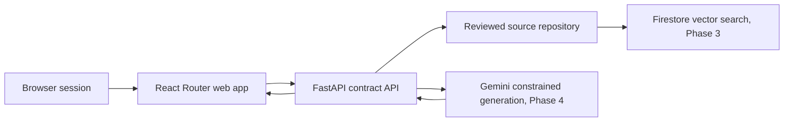

# BallotSense

A citation-first voter education platform. BallotSense helps a voter compare
choices through their stated priorities, but never displays a factual claim
without a link back to reviewed election material.

## Pinned project references

- [System design and delivery roadmap](docs/system-design-and-roadmap.md)
- [Source and citation policy](docs/source-policy.md)
- [AI execution playbook](docs/ai-execution-playbook.md)
- [Deferred features and omitted scope](docs/deferred-features.md)
- [MVP decision packet](docs/mvp-decision-packet.md)
- [Sequential execution plan](docs/execution-plan.md)

## Current milestone

We are building the trust layer against an archived June 2026 primary dataset.
That lets us test sourcing, review, retrieval, and citations before considering
a public November 2026 experience. Ballot-image upload and OCR are intentionally
omitted from the archive demo.

The product does **not** tell a voter how to vote. It presents cited,
attributed comparisons and says when verified information is unavailable.

## Repository layout

- `docs/source-policy.md` — source tiers, human-review rules, citation rules,
  and ballot-image privacy rules.
- `ballotsense_api/` — FastAPI contracts and source-catalog endpoints.
- `tests/` — checks that claims cannot be constructed without citations and
  approved sources require a recorded review time.
- `web/` — React Router framework app with Tailwind styling.
- `.github/workflows/ci.yml` — pull-request checks for the API and web app.

## Architecture



The current Phase 1 app keeps selected demo contests and lenses in React state
only. Reloading the page clears the session. It does not create accounts, store
voter preferences, upload ballot images, write browser storage, or attach
analytics identifiers.

## Run locally

Create a virtual environment, then install the project with its development
dependencies:

```bash
python3 -m venv .venv
source .venv/bin/activate
python -m pip install -e '.[dev]'
make api-dev
```

The API documentation is available at `http://127.0.0.1:8000/docs`.

Run the web app separately:

```bash
cd web
npm install
npm run dev
```

Run checks with:

```bash
make check
```

### Firestore development access

The development Firestore database is Native mode in `us-west1`. To run the
non-public ingestion command from a developer machine, authenticate Python with
Application Default Credentials; this opens a Google sign-in flow and stores no
credential in the repository:

```bash
gcloud auth application-default login
.venv/bin/python scripts/ingest_approved_corpus.py \
  --project ballotsense-mvp \
  --corpus-release measure-d-review-2026-07-12
```

The command accepts only the committed, reviewer-approved corpus artifacts and
does not generate embeddings.

Useful individual commands:

- `make api-lint` — lint the Python API with Ruff.
- `make api-test` — run the API contract tests.
- `make web-check` — run React Router type generation, TypeScript, and build.
- `make api-format` — format Python files with Ruff.

## Next

1. Ingest and human-review official June 2026 documents into Firestore.
2. Build contest-level retrieval that returns only approved chunks.
3. Require structured, cited output from the generation layer.
4. Revisit deferred convenience features only after privacy and release-corpus
   checks, including whether OCR is worth adding at all.
