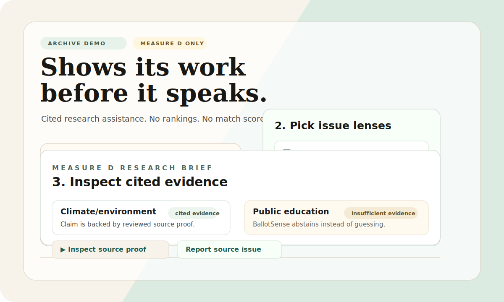
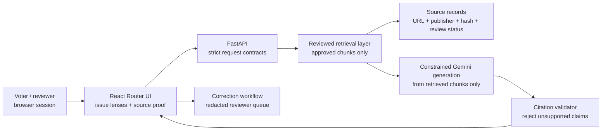
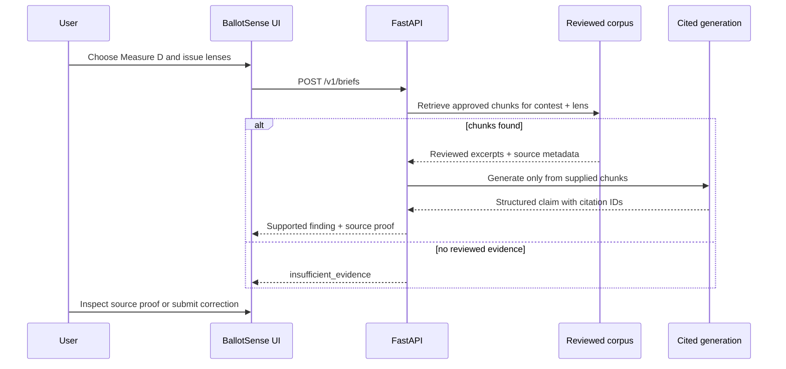

# BallotSense


**BallotSense is a citation-first voter education app.** It helps people inspect
reviewed election material through plain-English issue lenses, without telling
them how to vote.

The product premise is simple:

> BallotSense should show its work before it speaks.

Every voter-facing factual claim must point back to reviewed source material.
When the reviewed corpus cannot support an answer, BallotSense says so instead
of guessing.

<p align="center">
  
</p>

## Why this exists

Voter guides can be long, dense, and hard to compare. Most “match” tools risk
turning civic research into a black-box recommendation. BallotSense takes a
different posture:

| Instead of... | BallotSense does... |
| --- | --- |
| Ranking candidates or measures | Shows cited research assistance only |
| A single opaque match score | Explains how reviewed material relates to selected lenses |
| Answering everything | Uses explicit `insufficient_evidence` states |
| Trusting model memory | Requires reviewed source chunks and citation validation |
| Storing a voter profile | Keeps demo choices in browser session state only |

## Current demo scope

The current build target is an **Archived California November 2024 Proposition
36 demo corpus**. We are using the official California Secretary of State 2024
Voter Information Guide as ground truth so the citation pipeline and ballot
scanner can be validated now, without waiting for November 2026 voter-guide
publication.

The existing app is still an **archived June 2026 Santa Clara County demo**
centered on:

- **Measure D** — Santa Clara Valley Open Space Authority special parcel tax
- Fixed issue lenses:
  - housing affordability
  - public safety
  - climate/environment
  - public education
- Reviewed official/source-backed Measure D material
- Source-proof inspection
- Privacy-preserving correction reports
- Intentional abstention when evidence is missing

This demo is deliberately narrow. That narrowness is the point: it lets the
project prove the trust layer before expanding coverage.

## What the demo does not do

BallotSense currently does **not**:

- recommend, rank, or endorse choices;
- show a numeric candidate/measure match score;
- store durable political preferences;
- send ballot images to the backend;
- run OCR on user ballot photos;
- infer a voter’s address or ballot automatically;
- ingest November 2026 proposition material before official voter-guide sources
  are published;
- generate Prop 36 embeddings until the official 2024 voter-guide PDF is
  snapshotted, hashed, extracted, and reviewer-approved.

Ballot image capture now exists only as a browser-memory scanner prototype. OCR
and backend image upload remain intentionally omitted until the privacy and
review gates are ready.

## How it works



The core rule is that retrieval and generation are downstream of the reviewed
source record. A public claim is displayable only when it can point back to:

- source URL,
- publisher,
- election and contest binding,
- source type/tier,
- hash/snapshot metadata,
- chunk locator,
- reviewer status.

## Product flow



## What makes it compelling

BallotSense is not trying to be the loudest voting assistant. It is trying to be
the most inspectable one.

- **Abstention is a feature.** If the corpus cannot verify something, the UI says
  that directly.
- **Source records are the product spine.** Claims, chunks, reviews, corrections,
  and retrieval all revolve around source metadata.
- **Campaign material is labeled.** Official materials and campaign arguments are
  not silently treated as equivalent.
- **Privacy boundaries are visible.** The archive demo avoids accounts, ballot
  image upload, durable profiles, and automatic address lookup.
- **Reviewer workflow is first-class.** Corrections and source review are part of
  the system design, not an afterthought.

## Current Prop 36 2024 corpus work

The current ingestion target is:

- election: California November 5, 2024 General Election
- contest: Proposition 36
- master source:
  [Official Voter Information Guide PDF](https://vig.cdn.sos.ca.gov/2024/general/pdf/complete-vig.pdf)
- archive landing page:
  [California SOS 2024 General Election VIG archive](https://vigarchive.sos.ca.gov/2024/general/)

Run the Prop 36 source preparation commands:

```bash
make snapshot-prop36-source
make prepare-prop36-review
```

The promotion command is intentionally review-gated:

```bash
make promote-prop36-review
```

It should fail until the reviewer explicitly approves the pending review packet.

## November 2026 status

The next planned public-release corpus targets the **November 3, 2026 California
statewide general election**.

Current target planning:

| Role | Measure | Status |
| --- | --- | --- |
| Primary | Proposition 1 | Monitor-only; waiting for official voter-guide package |
| Secondary | Proposition 45 | Monitor-only; waiting for official voter-guide package |

The official SOS voter-guide page currently says the November 2026 guide will be
available around September 2026. Until those materials are published, BallotSense
does not snapshot, ingest, embed, or display Prop 1 / Prop 45 voter-facing
answers.

Re-check official source readiness:

```bash
make check-november-sources
```

## Tech stack

| Layer | Choice |
| --- | --- |
| Frontend | React Router / React, Tailwind CSS |
| Backend | Python, FastAPI, Pydantic |
| Retrieval | Firestore Native Vector Search, cosine distance |
| AI | Gemini constrained generation over reviewed chunks |
| Cloud | Google Cloud Run, Firestore Native, Vertex AI, Cloud Storage |
| Testing | Pytest, Ruff, TypeScript, Playwright accessibility checks |

## Repository map

| Path | Purpose |
| --- | --- |
| `web/` | React Router app and UI routes |
| `ballotsense_api/` | FastAPI contracts, retrieval, generation, corrections |
| `data/source_records/` | Reviewed source metadata |
| `data/corpus/` | Approved source chunks |
| `data/coverage/` | Coverage/readiness matrices |
| `docs/source-policy.md` | Source tiers, citation rules, review policy |
| `docs/ai-execution-playbook.md` | Current execution plan and phase status |
| `docs/deferred-features.md` | Features intentionally omitted for safety/privacy |
| `.github/workflows/ci.yml` | API and web CI checks |

## Run locally

Install API dependencies:

```bash
python3 -m venv .venv
source .venv/bin/activate
python -m pip install -e '.[dev]'
```

Install web dependencies:

```bash
cd web
npm install
cd ..
```

Run the API:

```bash
source .venv/bin/activate
make api-dev
```

Run the web app in another terminal:

```bash
npm --prefix web run dev
```

Useful local URLs:

- Web app: <http://127.0.0.1:5173/>
- API docs: <http://127.0.0.1:8000/docs>

Run all checks:

```bash
make check
```

Useful individual checks:

```bash
make api-lint
make api-test
make web-check
make check-november-sources
```

## Pinned project references

- [System design and delivery roadmap](docs/system-design-and-roadmap.md)
- [Source and citation policy](docs/source-policy.md)
- [AI execution playbook](docs/ai-execution-playbook.md)
- [Deferred features and omitted scope](docs/deferred-features.md)
- [Phase 8 November corpus plan](docs/phase-8-november-corpus-plan.md)
- [Phase 8 statewide measure inventory](docs/phase-8-statewide-measure-inventory.md)
- [Phase 8 source readiness check](docs/phase-8-source-readiness-2026-07-12.md)
- [Phase 8 archive demo polish pass](docs/phase-8-archive-demo-polish.md)
- [Phase 1–2 Prop 36 2024 corpus plan](docs/phase-1-2-prop36-2024-corpus.md)
- [Demo readiness checklist](docs/demo-readiness-checklist.md)
- [MVP decision packet](docs/mvp-decision-packet.md)
- [Sequential execution plan](docs/execution-plan.md)

## Roadmap

- Prepare and review the archived Prop 36 2024 corpus.
- Connect OCR only after the scanner privacy contract and Prop 36 review gate
  are ready.
- Monitor November 2026 official voter-guide publication.
- Extract, chunk, and human-review Prop 1 material.
- Add embeddings only after the reviewed corpus passes acceptance checks.
- Expand to Prop 45 only after the Prop 1 vertical slice is trustworthy.

BallotSense’s north star is not “answer faster.” It is **earn trust before
answering at all**.
