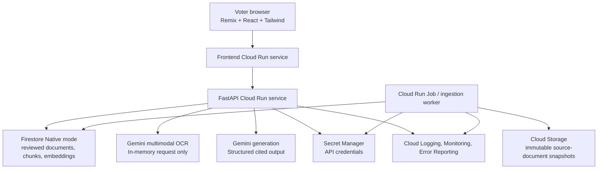
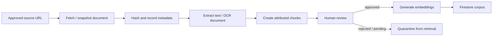
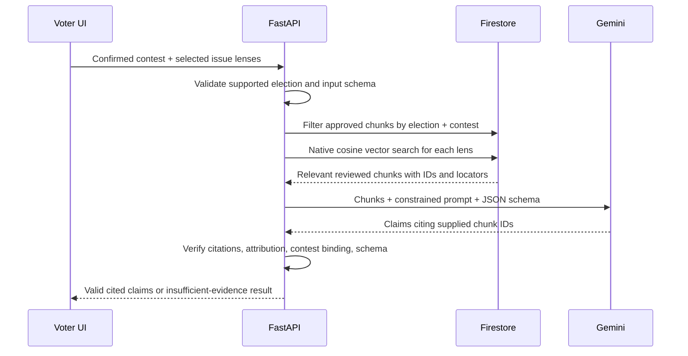

# BallotSense system design and delivery roadmap

## 1. Executive summary

BallotSense is a **citation-first, privacy-preserving voter research assistant**
for one local election at a time. It helps a voter understand the contests on
their ballot through a few priorities they choose, while keeping the voter in
control of the final decision.

The product does not endorse candidates, generate an opaque "best match," or
silently fill evidence gaps with model knowledge. It produces short, useful
research briefs where every displayable factual claim points to reviewed source
material.

### Initial delivery strategy

- Use the **Archived California November 2024 Proposition 36 demo corpus** as
  the current build target. The complete California Secretary of State 2024
  Voter Information Guide PDF is the master authenticity anchor for this corpus.
- Keep the earlier Measure D work as an internal archive-demo fixture and
  regression suite, not the current data-expansion target.
- Validate source quality, retrieval, explanation, citations, and voter
  usability before considering a public election deployment.
- A November 2026 release is a conditional goal, not a deadline. It happens
  only if source coverage and safety criteria are met.

### Product statement

> BallotSense turns a ballot into a private, personalized research brief where
> every important statement comes with its proof, and every evidence gap is
> visible.

## 2. Product boundaries

### 2.1 What the MVP does

1. A voter selects a small set of issue lenses.
2. The voter selects contests manually or—in the next experimental iteration—
   scans an **unmarked** ballot or official sample ballot to detect and confirm
   supported measures.
3. BallotSense shows a concise, cited explanation for each contest.
4. The voter can compare verified, attributed statements relevant to their
   selected lenses.
5. The voter can save private notes or choices for later reference.

### 2.2 What the MVP does not do

- Tell a voter whom to vote for.
- Show a single candidate "match score" or political ranking.
- Infer a political profile from free-form text.
- Treat campaign promises as independently verified facts.
- Store ballot images, ballot selections, or a durable voter profile by
  default.
- Claim completeness when a candidate or measure has insufficient reviewed
  source material.

### 2.3 Explicit design principles

| Principle | Product consequence |
| --- | --- |
| Evidence before fluency | A polished answer without valid citations is rejected. |
| User agency | Priorities order research; they do not become hidden recommendations. |
| Symmetry | Every candidate is searched and presented with the same source rules. |
| Honest uncertainty | "No verified position found" is a normal, useful result. |
| Privacy by default | Personal ballot and preference data are ephemeral unless a voter explicitly saves a note locally. |
| Hyper-local quality | Narrow coverage is preferable to broad but unreliable coverage. |
| Stateless services | Cloud Run services retain no request data on local disk. |

## 3. The differentiated experience

The differentiator is not simply "AI + a ballot." It is a **proof-carrying
voter guide**:

- Every generated sentence offers **Show the proof**.
- The proof identifies the publisher, source type, date, page/heading, and
  exact excerpt.
- Campaign material is labelled and attributed as a campaign statement.
- The interface exposes missing evidence instead of rewarding the candidate
  with the most polished website.
- A voter can understand a measure's concrete changes and tradeoffs without
  reading a legal document unaided.

### 3.1 The evidence coverage table

For a selected contest, show the state of available evidence without turning it
into a candidate judgment.

| Issue lens | Candidate A | Candidate B |
| --- | --- | --- |
| Housing | Filed candidate statement | Campaign statement, dated |
| Public safety | No verified position found | Filed candidate statement |
| Budget and taxes | No verified position found | No verified position found |

This table makes the corpus legible. It is not an endorsement, completeness
score, or inference that a missing statement means opposition.

### 3.2 Issue lenses for the first release

Use a small, visible, configurable set such as:

- Housing affordability
- Public safety
- Climate and environment
- Public education
- Taxes and government spending
- Transportation

The application should explain what each lens means operationally. For example,
"housing affordability" may retrieve reviewed statements relating to housing
supply, rent, homelessness, development approvals, or affordability programs.
It must not silently decide that every development-related statement supports a
particular ideology.

Free-text priorities may be considered only after the structured-lens flow,
retrieval evaluation, and explanation design are proven.

## 4. User experience design

### 4.1 Primary voter journey

1. **Welcome and trust promise**
   - Explain: no endorsements, citations on every claim, privacy defaults.
   - Link to source policy and correction process in plain language.

2. **Choose what matters**
   - Select up to three issue lenses.
   - Store selections only in browser session state by default.
   - Do not ask for party affiliation or demographic data.

3. **Find contests**
   - MVP: choose from a supported demo contest list.
   - Later: enter an address, resolve it to districts, show the inferred ballot,
     and ask the voter to confirm it.
   - Later still: upload an unmarked ballot/sample-ballot photo, extract
     contests, and require confirmation before any research begins.

4. **Contest brief**
   - Start with what the office controls or what the measure changes.
   - Show a two-minute plain-language summary.
   - Display comparisons relevant to the selected lenses.
   - Make every sentence or bullet expandable to its source evidence.
   - State source type: official, filed candidate statement, or campaign
     material.

5. **Evidence gap and uncertainty**
   - Use explicit states: `No verified position found`, `Source pending review`,
     and `Not covered in this demo`.
   - Never convert lack of evidence into a substantive conclusion.

6. **Private voting notes**
   - Let the voter bookmark a contest and write a note.
   - Keep notes in browser local storage or an exportable file; do not send
     choices to the backend.
   - Allow the voter to clear all local data from one obvious control.

7. **Feedback and corrections**
   - Let users report an inaccurate or missing citation.
   - Capture only the report, cited claim ID, and optional contact information;
     never include ballot images or inferred choices.

### 4.2 Later ballot-image flow

Ballot scan is a convenience feature, not a prerequisite for useful research.

1. Warn the voter to photograph an **unmarked ballot or official sample
   ballot**.
2. Explain that images are processed in memory and discarded after extraction.
3. Send the image directly to the OCR endpoint over TLS.
4. Extract only contest/office/measure names and candidates needed to identify
   ballot items.
5. Return a confirmation checklist; the voter corrects any OCR mistake.
6. Delete the in-memory image buffer after the response, including on failure.
7. Use only confirmed contest IDs for retrieval.

The app must never display or infer filled bubbles, write-ins, or voting
selections. When image storage, logging, or retention cannot be ruled out, the
scan feature must stay disabled.

### 4.3 Visual language and accessibility

- Mobile-first single-column reading experience with large tap targets.
- Plain language first; legal source text remains available on demand.
- Do not use red/green alone to signify a choice or confidence level.
- Meet WCAG 2.2 AA for contrast, keyboard navigation, semantic headings,
  form labels, focus states, and screen-reader source descriptions.
- Write source-type labels in text, not only icons.
- Design for English first, with content and schemas that can support Spanish,
  Chinese, Vietnamese, and other required languages later.

## 5. Core architecture

### 5.1 Components and responsibilities

| Component | Technology | Responsibility |
| --- | --- | --- |
| Voter UI | Remix, React, Tailwind | Browser session state, selected lenses, consent, confirmed contests, evidence display, local-only notes. |
| Frontend service | Cloud Run | Serves Remix application; contains no election facts or secret keys. |
| API service | Python, FastAPI, Cloud Run | Validates requests, orchestrates retrieval and Gemini, validates citations, provides only approved data. |
| Corpus store | Firestore Native mode | Election metadata, entities, document metadata, reviewed chunks, embeddings, generated-claim audit records. |
| Artifact store | Cloud Storage | Versioned raw official PDFs/pages or permitted source snapshots; source hashes bind records to the exact artifact reviewed. |
| Ingestion worker | Cloud Run Job | Fetches approved documents, extracts text, chunks, embeds, stages material for human review. |
| Retrieval | Firestore Vector Search | Performs native cosine-similarity search within strict election/contest/review filters. |
| Model layer | Gemini API | OCR and bounded generation from supplied chunks only. |
| Secrets | Secret Manager | Gemini credential, service configuration, and any external source credentials. |
| Observability | Cloud Logging, Monitoring, Error Reporting | Operational metrics and redacted error records; no ballot images or voter preferences. |

### 5.2 Statelessness

Every Cloud Run instance must be replaceable at any time:

- No request data is written to local disk.
- Image bytes exist only in request memory and are released after processing.
- Persistent election material belongs in Firestore and Cloud Storage.
- Batch ingestion uses Cloud Run Jobs, not a long-lived API process.
- Caches must be derived from reviewed public corpus data only; never cache a
  ballot image, address, voter priority set, or personal note on the server.

## 6. Data design

### 6.1 Firestore collection design

Use explicit IDs so every result is bound to the correct election and contest.

| Collection | Key fields | Purpose |
| --- | --- | --- |
| `elections` | `id`, name, date, status, jurisdiction scope | Defines a single supported election dataset. |
| `jurisdictions` | `id`, name, type, parent ID, district identifiers | Represents county, city, school, legislative, and other ballot geographies. |
| `contests` | `id`, election ID, jurisdiction ID, type, title, office/measure metadata | A race or ballot measure a voter can research. |
| `candidates` | `id`, contest ID, name, ballot label, party label if officially listed | Candidate identity as it appears for a contest. |
| `measures` | `id`, contest ID, ballot question, official title, measure type | Structured measure information. |
| `sources` | metadata listed below | A source document and its review record. |
| `source_chunks` | source ID, election ID, contest ID, text, locator, embedding | Verbatim retrievable units, only searchable when approved. |
| `ingestion_runs` | source ID, tool/version, timestamps, result, errors | Reproducibility and operational traceability. |
| `claim_audits` | request class, retrieved chunk IDs, response claims, validator result | Redacted quality and traceability audit—not voter identity. |
| `correction_reports` | claim/source ID, report text, status, reviewer outcome | Human correction workflow. |

### 6.2 Source document record

Every `sources` record must include:

- Stable source ID and title.
- Canonical public URL.
- Publisher and source type.
- Election ID, jurisdiction, and relevant contest/candidate/measure IDs.
- Publication date when known and retrieval timestamp.
- SHA-256 hash of the reviewed artifact.
- Artifact location in Cloud Storage, where storage is permitted.
- Review status: `pending`, `approved`, or `rejected`.
- Reviewer identity, review time, and review notes.
- Supersedes/superseded-by relationship for revised documents.

Only records marked `approved` are eligible for retrieval.

### 6.3 Source chunk record

Each chunk contains:

- Stable chunk ID and parent source ID.
- Election and contest ID; candidate or measure ID where relevant.
- Verbatim extracted text.
- Human-readable locator such as PDF page, section, heading, or paragraph.
- Extraction method/version and offsets, when available.
- Embedding vector and embedding-model version.
- Inherited review status or an explicit `approved_for_retrieval` flag.

Chunks should be small enough to cite precisely, typically one coherent paragraph
or section. Avoid splitting a qualifying statement from its attribution or
negation.

### 6.4 Claim record

A displayable generated claim contains:

- Short text.
- Claim category: `official_fact`, `candidate_statement`,
  `campaign_statement`, `measure_explanation`, or `insufficient_evidence`.
- One or more `(source_id, chunk_id, locator)` citations.
- Required attribution for candidate/campaign material.
- The generation run ID and validator decision.

A claim with zero citations is invalid and cannot reach the UI.

### 6.5 Source tiers

The authoritative implementation rules are in
[source-policy.md](source-policy.md). In brief:

1. Official ballots, measure text, voter guides, and elections-office materials
   support factual election information.
2. Filed candidate statements support candidate self-description and must be
   attributed.
3. Official campaign material supports a candidate's stated position and must
   be labelled and dated.
4. News, endorsements, social posts, and third-party scorecards are excluded
   from the first corpus unless the source policy is deliberately expanded.

## 7. AI and retrieval pipeline

### 7.1 Offline ingestion pipeline

Detailed steps:

1. A curator adds an allowed source URL and assigns election, jurisdiction, and
   source type.
2. The ingestion job obtains a snapshot under the source policy, records a
   SHA-256 hash, and retains original provenance.
3. Text is extracted. OCR output is marked as extracted text, not as an
   unquestioned original.
4. Chunks are created with source attribution, contest bindings, and locators.
5. A human reviewer checks document identity, text quality, attribution,
   contest bindings, and sensitive/ambiguous content.
6. Only after approval are embeddings generated and chunks exposed to vector
   retrieval.
7. Corpus revisions create a new version; they do not overwrite provenance.

### 7.2 Online answer pipeline

Detailed steps:

1. The frontend sends only confirmed contest IDs and selected structured lenses.
2. FastAPI validates format, rate limits the request, and rejects unsupported
   elections/contests.
3. It builds retrieval queries using the contest, candidate/measure context,
   and each selected lens.
4. Firestore performs **native cosine similarity** vector search. Every query
   filters on the election, relevant contest/entity, and approved review state.
5. The API builds a bounded evidence packet. It includes text, source IDs,
   locators, source type, dates, and permitted attribution; it contains no
   unrelated web content.
6. Gemini receives an explicit instruction that it may use only the evidence
   packet and must return structured JSON claims with citations to those chunk
   IDs. It must return `insufficient_evidence` when the packet does not support
   a claim.
7. A deterministic API validator rejects output that:
   - has no citation for a factual claim;
   - cites a chunk outside the evidence packet;
   - cites an unapproved or wrong-contest chunk;
   - omits required campaign/candidate attribution;
   - fails the output schema; or
   - includes a recommendation or prohibited score.
8. If validation fails, the API retries once with a corrective prompt or
   returns the safe insufficient-evidence state. It never falls back to an
   uncited answer.
9. The API returns claims, source cards, and the exact citation links for the
   UI to render.

### 7.3 Prompt boundaries

The generation system prompt must require the model to:

- Use only supplied reviewed chunks; no baseline knowledge or web knowledge.
- Preserve uncertainty and attribution.
- Never endorse, rank, or recommend a candidate or a ballot choice.
- Never infer a candidate's position from party label, biography, omission, or
  unrelated statements.
- Never state a causal prediction as fact.
- Return strict JSON matching the response schema.
- Say `insufficient_evidence` rather than guessing.

Prompting is a guardrail, not the enforcement mechanism. The API validator and
the reviewed corpus are the enforcement mechanism.

### 7.4 Evaluation before public use

Create an offline evaluation set with reviewed questions across measures,
candidates, ambiguous statements, OCR errors, and evidence gaps. Track:

- Citation validity: percentage of citations that resolve to the exact chunk.
- Citation support: percentage of claims a reviewer agrees are supported by
  the cited text.
- Unsupported-claim rate: target 0 in acceptance tests.
- Correct abstention rate: whether the system says insufficient evidence when
  sources lack an answer.
- Source-type attribution accuracy.
- Retrieval recall: whether relevant reviewed chunks appear in the evidence
  packet.
- Cross-candidate symmetry: whether the same source/search rules ran for all
  candidates in a contest.

No live release occurs until the evaluation set passes defined thresholds and a
human reviewer signs off on the corpus.

## 8. Memory, privacy, and retention

"Memory" has three different meanings in this system. They must remain
separate.

| Memory type | Design decision |
| --- | --- |
| Model/conversation memory | Do not provide long-term voter memory to Gemini. Each answer is bounded to the current request, selected lenses, and evidence packet. |
| Voter session state | Keep selected lenses, confirmed contests, and draft notes in the browser. Clear at end of session unless the voter explicitly keeps local notes. |
| Election knowledge corpus | Persist only reviewed public election material, provenance, embeddings, and redacted quality records in GCP. |

### 8.1 Data never retained by default

- Ballot images and raw image OCR payloads.
- Filled ballot selections, inferred selections, or write-ins.
- Full street address after ballot resolution.
- Selected issue lenses tied to an identifiable person.
- Personal notes or saved choices on backend infrastructure.
- Raw model prompts/responses containing voter-specific data in logs.

### 8.2 Permitted persistent data

- Public, reviewed election documents and source snapshots.
- Corpus metadata, extracted chunks, embeddings, and reviewer actions.
- Redacted aggregate metrics such as validation failures by contest.
- Opt-in correction reports, with minimal contact information if submitted.

### 8.3 Browser storage

If local persistence is enabled for notes:

- Use browser local storage or IndexedDB under an explicit explanation.
- Do not synchronize to a server by default.
- Provide `Clear my local data` in settings and at the end of a session.
- Never treat a local note as a source or input to the generation pipeline.

## 9. API design

### 9.1 Initial API groups

| Group | Example endpoints | Purpose |
| --- | --- | --- |
| Operations | `GET /healthz` | Health/readiness checks. |
| Election catalog | `GET /v1/elections`, `GET /v1/contests` | Supported corpus and contest discovery. |
| Sources | `GET /v1/sources/{id}`, `GET /v1/claims/{id}/evidence` | Public evidence and provenance view. |
| Research | `POST /v1/contests/{id}/brief` | Returns validated, cited contest brief for selected lenses. |
| Ballot resolution | `POST /v1/ballots/resolve-address` | Future; ephemeral address-to-contest resolution. |
| OCR | `POST /v1/ballots/extract-contests` | Future; in-memory image processing and contest candidates only. |
| Corrections | `POST /v1/corrections` | Report a missing or inaccurate source/claim. |
| Internal curation | protected ingestion/review endpoints | Not exposed to voters; creates and approves corpus material. |

### 9.2 Request/response rules

- All input is validated with Pydantic schemas.
- All IDs are server-owned stable identifiers; clients do not submit raw source
  chunks as evidence.
- Research endpoint requests include only contest ID plus selected structured
  lens IDs.
- Research responses include claims, evidence states, sources, and no hidden
  score.
- Every factual display claim contains at least one citation object.
- API errors are safe and do not disclose internal prompts, secrets, or
  unreviewed corpus records.

## 10. Security and trust controls

### 10.1 Application security

- HTTPS only; modern TLS configuration.
- Strict CORS allowlist between the deployed frontend and API.
- Content Security Policy appropriate for the Remix app.
- Request-size limits, MIME-type checks, malware scanning policy, and rate
  limits for the future image endpoint.
- Parameterized Firestore access through service code; no client access to
  internal corpus review records.
- Least-privilege service accounts: frontend cannot read Firestore; API gets
  only required collections; ingestion job gets controlled artifact writes.
- Store credentials solely in Secret Manager; never in source control or `.env`
  files containing production keys.

### 10.2 Election integrity controls

- Corpus freezes/version labels for each release.
- Human review before material is retrievable.
- Reviewer audit trail and source-hash checks.
- Visible source type and date.
- Published correction policy with a clear way to report problems.
- Stable source URLs and archived snapshot references so a changed campaign page
  does not silently rewrite past evidence.
- Release checklist requiring equal retrieval/review treatment for all
  candidates within each supported contest.

### 10.3 Logging and observability

Log only what is needed to operate and improve the system:

- Request ID, endpoint, latency, status, model-validation result, and corpus
  version.
- Aggregate counts of retrieved chunks and invalid generation attempts.
- Sanitized exception traces.

Do not log ballot bytes, address, selected lenses, notes, raw prompts containing
them, or model responses that could reconstruct voter preferences.

## 11. Deployment design

### 11.1 Environments

Maintain three isolated environments:

| Environment | Purpose | Data |
| --- | --- | --- |
| Development | Local feature work and synthetic fixtures | No real ballot images; sample public source metadata only. |
| Staging | Integration, evaluation, and reviewer acceptance | Reviewed non-production corpus or exact release candidate corpus. |
| Production | Public voter experience | Approved, versioned election corpus only. |

Use separate GCP projects where practical, or at minimum separate service
accounts, secret scopes, Firestore namespaces/collections, and Cloud Storage
buckets with no cross-environment write access.

### 11.2 GCP deployment components

1. Containerize the Remix frontend and FastAPI backend separately.
2. Push versioned images to Artifact Registry.
3. Deploy both as Cloud Run services with minimum instances set according to
   launch needs and maximum instances/cost alerts configured.
4. Run ingestion as a Cloud Run Job triggered manually or through an approved
   release workflow; do not expose it as a public endpoint.
5. Configure Firestore Native mode and a vector index using cosine distance for
   the `source_chunks.embedding` field.
6. Use a private Cloud Storage bucket for source snapshots, with access only to
   curation/ingestion identities.
7. Store secrets in Secret Manager and attach them to the relevant service
   identity at runtime.
8. Configure Cloud Monitoring dashboards, uptime checks, alerting, and Error
   Reporting.
9. Put the public frontend behind a managed custom domain and CDN/cache policy
   that excludes personalized API responses.

### 11.3 CI/CD and infrastructure as code

- Use Terraform for GCP resources: Cloud Run, IAM, Firestore indexes, buckets,
  Secret Manager bindings, monitoring, and budgets.
- On every pull request: run formatting, unit tests, API contract tests, and
  security/dependency scans.
- On staging deploy: run integration tests against the retrieval/generation
  evaluator and a fixed reviewed corpus.
- Production release requires: code approval, source corpus approval, evaluator
  pass, smoke test, and rollback image/version.
- Deploy immutable container tags. Record the code revision and corpus version
  together in the release record.

### 11.4 Rollback

- Roll back application code by Cloud Run revision.
- Roll back corpus exposure by switching the active approved corpus version;
  do not delete the newer record.
- Disable a problematic contest or source immediately through a server-side
  release flag, returning a transparent temporarily-unavailable message rather
  than an uncited replacement.

## 12. Delivery plan

Each phase has a small, testable outcome. Do not advance based only on a UI
demo; advance when the phase's acceptance criteria pass.

### Phase 0 — Product contract and governance

**Goal:** Agree on the product promise and what it will not do.

Tasks:

1. Approve this system design and the source policy.
2. Use the archived California November 2024 Proposition 36 corpus as the
   current end-to-end demo target.
3. Define the issue-lens list and plain-language descriptions.
4. Define source tiers, review roles, correction workflow, and election-release
   owner.
5. Write voter-facing trust, privacy, and non-endorsement language.

Done when:

- The team can describe a claim that is allowed, disallowed, and insufficiently
  evidenced.
- Every first-demo contest has a named source acquisition plan.

### Phase 1 — Repository and local engineering foundation

**Goal:** Establish a safe development workflow.

Tasks:

1. Scaffold the Remix frontend and FastAPI API.
2. Add Python Pydantic contracts for sources, chunks, citations, and claims.
3. Add test, lint, formatting, and environment templates without secrets.
4. Add the source policy, architecture guide, and contributing instructions.
5. Add synthetic fixtures only; do not claim they are election facts.

Done when:

- A new developer can run both services locally.
- A factual claim without a citation fails schema/API tests.
- No credential or personal ballot data is committed.

### Phase 2 — Curated source corpus and review workflow

**Goal:** Make an auditable small corpus before building AI answers.

Tasks:

1. Identify official primary-election guides, ballot language, filed candidate
   statements, and permitted campaign materials.
2. Create source records with URL, hash, date, jurisdiction, source type, and
   reviewer fields.
3. Snapshot source artifacts where permitted and extract text.
4. Chunk text with page/heading locators and map chunks to contests/entities.
5. Build an internal review screen or controlled review checklist.
6. Approve a small subset of high-quality chunks and retain rejected records.

Done when:

- Every approved chunk opens its parent source and locator.
- A reviewer can explain why every included source belongs in the corpus.
- The corpus includes deliberate "no evidence" cases for testing.

### Phase 3 — Firestore and retrieval

**Goal:** Retrieve the right reviewed evidence, not merely semantically similar
text.

Tasks:

1. Provision Firestore Native mode schema and native cosine vector indexes.
2. Implement a Firestore repository behind the existing source contract.
3. Generate versioned embeddings for approved chunks only.
4. Build contest/lens retrieval with hard metadata filters.
5. Add retrieval tests for expected evidence, wrong contest exclusion, rejected
   source exclusion, and source-type diversity.

Done when:

- Retrieval never returns chunks from another election or unapproved source.
- Test queries return reviewed, relevant passages with correct locators.

### Phase 4 — Constrained generation and validation

**Goal:** Generate only display-safe, cited contest briefs.

Tasks:

1. Define strict JSON schemas for claims, citations, attribution, and
   insufficient-evidence states.
2. Implement Gemini evidence-packet prompting.
3. Build deterministic citation, source-status, entity-binding, and attribution
   validators.
4. Build a safe retry/abstention path.
5. Create offline evaluation fixtures and human-review scoring workflow.

Done when:

- Tests demonstrate that invalid citations and recommendation language are
  rejected.
- Evaluation reports zero unsupported display claims in the acceptance set.
- The system visibly abstains when sources do not support an answer.

### Phase 5 — Voter-facing research UI

**Goal:** Prove that cited research is understandable in a few minutes.

Tasks:

1. Build welcome/trust page and structured issue-lens selection.
2. Build supported-contest picker for the archive demo.
3. Build contest brief cards, source-type badges, evidence coverage table, and
   expandable citations.
4. Build explicit unavailable/unknown states.
5. Add local-only notes/bookmarks and clear-local-data control.
6. Perform accessibility and mobile-device review.

Done when:

- A test voter can find and open the proof behind every claim.
- A missing candidate position is not visually mistaken for opposition.
- The UI works on a phone without requiring an account.

### Phase 6 — End-to-end demo and user research

**Goal:** Validate the product with a small, controlled audience.

Tasks:

1. Deploy the archive demo to staging or a limited-access public environment.
2. Run moderated usability sessions with varied voters.
3. Test comprehension of sources, campaign labels, uncertainty, and measure
   explanations.
4. Review feedback, incorrect citations, confusion points, and source gaps.
5. Iterate on wording and corpus; preserve correction history.

Done when:

- Participants understand that BallotSense is research support, not a voting
  recommendation.
- Participants can distinguish official material from campaign statements.
- No high-severity citation or privacy issue remains open.

### Phase 7 — Optional ballot discovery and OCR

**Goal:** Reduce ballot-discovery friction without expanding privacy risk.

Tasks:

1. First implement address-based ballot resolution with explicit confirmation.
2. Evaluate whether address resolution covers the intended ballots reliably.
3. Build in-memory Gemini OCR endpoint for unmarked/sample ballot images.
4. Add a clear consent screen, image size/type validation, and no-storage tests.
5. Require user confirmation of every extracted contest before retrieval.
6. Red-team for marked-ballot and accidental-image retention scenarios.

Done when:

- OCR errors cannot silently change the researched contest list.
- Automated tests and logs demonstrate no ballot bytes are persisted.
- The feature can be disabled independently without affecting the core guide.

### Phase 8 — November public-release gate

**Goal:** Make a deliberate launch decision, not a deadline-driven one.

Tasks:

1. Gather and review official November election materials once available.
2. Create a complete contest-coverage matrix for the supported geography.
3. Rerun retrieval and citation evaluations against the new corpus.
4. Perform security review, accessibility audit, load/cost testing, and rollback
   drill.
5. Obtain human sign-off on source coverage and public disclosures.

Release only when:

- Every displayed contest meets the published source-coverage minimum.
- Citation-support evaluation passes the agreed threshold.
- No known path stores ballot images or voter selections.
- Monitoring, correction workflow, incident response, and rollback have owners.

Otherwise, keep the system as an educational archive demo and continue
improving it for a later election.

## 13. Key risks and decisions

| Risk | Mitigation | Release rule |
| --- | --- | --- |
| Hallucinated claim | Reviewed corpus, structured citations, deterministic validator, human evaluation | Do not display unsupported claims. |
| Source bias or uneven coverage | Source tiers, same workflow for all candidates, visible evidence gaps | Do not imply absence means a position. |
| Stale source changes | Hashes, snapshots, source versions, corpus release tags | Re-review revised documents before retrieval. |
| OCR mistake | User confirmation and manual selection fallback | Never auto-select a contest solely from OCR. |
| Marked-ballot privacy exposure | Unmarked-ballot guidance, no storage/logging, feature flag | Disable scan if retention cannot be guaranteed. |
| Election timing pressure | Archive demo first and launch gates | Miss a deadline rather than ship unreliable coverage. |
| Misleading scores | No candidate score in MVP; show evidence coverage instead | Do not label relevance as endorsement. |
| Cost spike near election | Cloud Run limits, request quotas, cache public corpus only, budgets/alerts | Gracefully degrade to static cited material if necessary. |

## 14. Current repository state

At the time this guide was written, the repository contains only an early,
uncommitted trust-layer scaffold:

- Source/citation Pydantic contracts.
- An empty local source-catalog API contract.
- Source-policy documentation.
- Basic tests ensuring approved sources have review timestamps and claims need
  citations.

It does **not** yet contain a Remix UI, Firestore integration, Gemini calls,
election corpus, ingestion process, deployment infrastructure, or a live
product. Each is intentionally covered as a separate delivery phase above.

## 15. Immediate next action

Before writing more application code, complete Phase 0:

1. Approve or revise the non-endorsement, evidence-first product boundary.
2. Choose the first three to five archived June 2026 contests/measures.
3. Confirm the initial issue lenses.
4. Identify the official documents that will form the first reviewed corpus.

Once those decisions are made, Phase 1 and Phase 2 can proceed in small,
verifiable increments.
